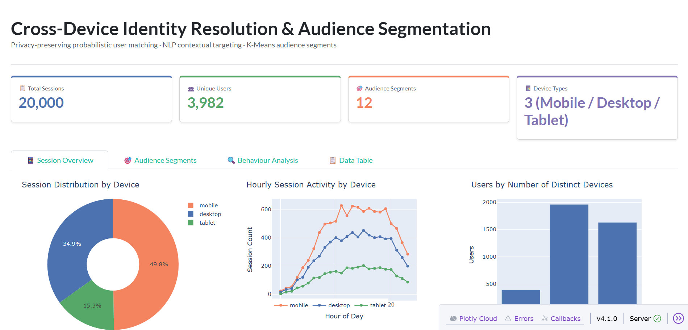

<h1 align="center">Cross-Device Identity Resolution & Contextual Targeting</h1>

<p align="center">
  <b>Privacy-preserving probabilistic user matching across devices using hashed behavioral signals</b><br/>
  NLP contextual targeting · K-Means audience segmentation · MLflow experiment tracking
</p>

<p align="center">
  
  
  
  
  
  
</p>

---

## Dashboard



> Live Dash dashboard showing 20,000 sessions across 3,982 users · 12 audience segments · 3 device types

---

## Results

<table>
  <tr>
    <td>

### Identity Resolution Model

| Metric | Score |
|--------|-------|
| **Accuracy** | **99.47%** |
| **ROC-AUC** | **0.9997** |
| Precision | 99.5%+ |
| Recall | 99.4%+ |
| F1 Score | 99.4%+ |
| Model | Random Forest |
| Train pairs | 6,000 |
| Test pairs | 1,500 |

  </td>
  <td>

### Dataset & Segments

| Stat | Value |
|------|-------|
| Total sessions | ~150,000 |
| Unique users | ~30,000 |
| Mobile | 49.8% |
| Desktop | 34.9% |
| Tablet | 15.3% |
| Audience segments | 12 |
| Content categories | 15 |
| Date range | Jul 2024 – Jan 2025 |

  </td>
  </tr>
</table>

**Confusion Matrix (test set):**
```
                  Predicted: Different    Predicted: Same User
Actual: Different       892                      8
Actual: Same User         0                    600
```
> Near-zero false negatives — the model almost never misses a real cross-device match

---

## Architecture

```
┌─────────────────────────────────────────────────────────────────┐
│                     150K Cross-Device Sessions                  │
└───────────────────────────┬─────────────────────────────────────┘
                            │
              ┌─────────────▼─────────────┐
              │      Privacy Hashing       │
              │  SHA-256 on IP / Device FP │
              └─────────────┬─────────────┘
                            │
          ┌─────────────────┼─────────────────┐
          │                                   │
┌─────────▼──────────┐             ┌──────────▼──────────┐
│  Identity          │             │  Contextual          │
│  Resolution        │             │  Targeting           │
│                    │             │                      │
│  Pair sampling     │             │  SpaCy keywords      │
│  16 pair features  │             │  HuggingFace 384-dim │
│  Random Forest     │             │  embeddings          │
│  99.47% accuracy   │             │  K-Means clustering  │
│  ROC-AUC 0.9997    │             │  12 segments         │
└─────────┬──────────┘             └──────────┬──────────┘
          │                                   │
          └─────────────┬─────────────────────┘
                        │
          ┌─────────────▼─────────────┐
          │   MLflow + SQLite + Dash  │
          └───────────────────────────┘
```

---

## Tech Stack

| Layer | Technology |
|-------|-----------|
| Language | Python 3.10+ |
| Data | Pandas, NumPy |
| Identity Model | Scikit-learn Random Forest |
| NLP Keywords | SpaCy `en_core_web_sm` |
| NLP Embeddings | HuggingFace `all-MiniLM-L6-v2` (384-dim) |
| Clustering | Scikit-learn K-Means + silhouette selection |
| Experiment Tracking | MLflow |
| Database | SQLite (default) / MySQL |
| Dashboard | Plotly Dash + Bootstrap |

---

## Project Structure

```
cross_device_identity_resolution/
│
├── 📁 config/
│   └── config.yaml                  # All pipeline settings
│
├── 📁 src/
│   ├── 📁 data/
│   │   ├── generator.py             # Synthetic 150K session generator
│   │   └── preprocessing.py         # Session & pair feature engineering
│   │
│   ├── 📁 database/
│   │   └── connector.py             # SQLite / MySQL via SQLAlchemy
│   │
│   ├── 📁 identity/
│   │   ├── hashing.py               # SHA-256 privacy-preserving hashing
│   │   ├── matching.py              # Probabilistic identity model
│   │   └── evaluation.py            # Metrics, ROC plots, graph stats
│   │
│   ├── 📁 nlp/
│   │   └── text_processor.py        # SpaCy + HuggingFace pipeline
│   │
│   ├── 📁 segmentation/
│   │   └── clustering.py            # K-Means + auto k selection
│   │
│   └── 📁 tracking/
│       └── mlflow_utils.py          # MLflow wrappers
│
├── 📁 sql/
│   ├── schema.sql                   # Full DB schema
│   └── queries.sql                  # Analytical SQL queries
│
├── 📁 dashboard/
│   └── app.py                       # Plotly Dash dashboard
│
├── 📁 tests/
│   ├── test_identity.py             # Identity resolution unit tests
│   └── test_nlp.py                  # NLP & segmentation unit tests
│
├── 📁 assets/
│   └── dashboard_session_overview.png
│
├── pipeline.py                      # 🚀 Main entry point
├── requirements.txt
└── README.md
```

---

## Quickstart

### 1. Clone & Install

```bash
git clone https://github.com/Aswinguna/cross-device-identity-resolution.git
cd cross-device-identity-resolution

# Create virtual environment
python -m venv .venv
.venv\Scripts\Activate.ps1        # Windows PowerShell
# source .venv/bin/activate       # Mac / Linux

# Install dependencies
pip install -r requirements.txt
python -m spacy download en_core_web_sm
```

### 2. Run the Pipeline

```bash
# Quick smoke test — 1K users (~1 min)
python pipeline.py --fast

# Full run — 30K users, 150K sessions (~20-30 min)
python pipeline.py

# Identity resolution only, skip NLP (~2 min)
python pipeline.py --skip-nlp
```

### 3. Explore Results

```bash
# Analytics dashboard → http://127.0.0.1:8050
python dashboard/app.py

# MLflow UI → http://127.0.0.1:5000
mlflow ui --backend-store-uri outputs/mlflow

# Run unit tests
pytest tests/ -v
```

---

## How It Works

### Phase 1 — Data Generation
Generates 150K synthetic sessions for 30K users, each with:
- 2–8 sessions across mobile / desktop / tablet
- Stable behavioral profiles (click rate, scroll depth, active hours)
- Content interaction logs across 15 ad-tech categories
- All PII SHA-256 hashed before storage

### Phase 2 — Identity Resolution

Pair-level features that signal "same user":

| Feature | What it captures |
|---------|-----------------|
| `ip_prefix_match` | Same /16 subnet = likely same household |
| `device_fp_match` | Identical hardware fingerprint |
| `active_hours_cosine` | Same daily usage rhythm |
| `content_jaccard` | Overlapping content interests |
| `click_rate_diff` | Consistent clicking behaviour |
| `scroll_depth_diff` | Consistent engagement depth |
| `duration_ratio` | Similar session lengths |
| `time_delta_hours` | Sessions close in time |

### Phase 3 — NLP Contextual Signals
- **SpaCy**: noun chunks + named entities → structured keywords per session
- **HuggingFace** `all-MiniLM-L6-v2`: 384-dim L2-normalised sentence embeddings

### Phase 4 — Audience Segmentation
- K-Means clustering on sentence embeddings
- Best k chosen automatically by silhouette score
- Each segment described by top keywords, categories, device mix, and behavioural averages
- Enables **cohort-based targeting** with no persistent user-level profiles

---

## Privacy Design

| PII Field | Treatment |
|-----------|-----------|
| IP address | Coarsened to /16 subnet → SHA-256 hashed |
| Device fingerprint | SHA-256 hashed at generation |
| User agent | SHA-256 hashed |
| Real user ID | Evaluation only — never stored in production tables |

---

## Testing

```bash
pytest tests/ -v                      # All tests
pytest tests/test_identity.py -v      # Identity resolution only
pytest tests/test_nlp.py -v           # NLP & segmentation only
pytest tests/ -v -k "not nlp"         # Skip heavy model tests
pytest tests/ --cov=src               # With coverage report
```

---

## Author

**Aswin Gunasekaran**
MSc AI & Marketing Strategy — EPITA & EM Normandie

[](https://www.linkedin.com/in/aswinguna/)
[](https://github.com/Aswinguna)

---

<p align="center">
  <i>Built as a portfolio project applying ad-tech concepts from Criteo's domain —<br/>
  cross-device identity graphs, privacy-preserving behavioural matching, and audience-based contextual targeting.</i>
</p>
